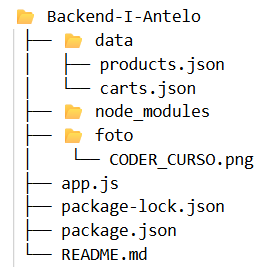

---

<h1>🧩 Proyecto Backend I - API de Productos y Carritos</h1>

Este proyecto implementa un servidor Node.js con Express que gestiona productos y carritos de compra, utilizando archivos JSON para asegurar la persistencia de la información.

<h2>🚀 Tecnologías utilizadas</h2>

Node.js

Express

File System (fs) para manejo de archivos JSON

<h2>⚙️ Estructura del proyecto</h2>

            

<h2>🧠 Endpoints </h2>
<h3>📦 PRODUCTOS (/api/products)</h3>
<strong>GET /api/products</strong>

Obtiene todos los productos almacenados.

<h4>📤 Respuesta:</h4>

[
  {
    "id": 1,

    "title": "Microscopio óptico",

    "description": "Microscopio binocular con aumento de 1000x",

    "code": "MIC001",

    "price": 250000,

    "status": true,

    "stock": 5,

    "category": "Equipos ópticos",

    "thumbnails": []
  }
]

---

<strong>GET /api/products/:pid</strong>

Obtiene un producto por su id.

<h4>📤 Respuesta exitosa (201):</h4>
se obtiene el producto por id seleccionado como este ejemplo

[
  {

    "id": 1,

    "title": "Microscopio óptico",

    "description": "Microscopio binocular con aumento de 1000x",

    "code": "MIC001",

    "price": 250000,

    "status": true,

    "stock": 5,

    "category": "Equipos ópticos",

    "thumbnails": []
  }
]

<h4>📛 Errores posibles (404):</h4>
{ "error": "Producto no encontrado" }

---

<strong>POST /api/products</strong>
Agrega un nuevo producto.

<h4>📥 Body (JSON):</h4>
{
  "title": "Autoclave de laboratorio",

  "description": "Esterilizador por vapor de 20L",

  "code": "AUT001",

  "price": 600000,

  "status": true,

  "stock": 3,

  "category": "Equipos de esterilización",

  "thumbnails": []
}

<h4>📤 Respuesta exitosa (201):</h4>
{
  "id": 2,

  "title": "Autoclave de laboratorio",

  "description": "Esterilizador por vapor de 20L",

  "code": "AUT001",

  "price": 600000,

  "status": true,

  "stock": 3,

  "category": "Equipos de esterilización",

  "thumbnails": []
}

---

<strong>PUT /api/products/:pid</strong>

Actualiza los datos de un producto existente.

<h4>📥 Body (JSON):</h4>

{
  "price": 270000,

  "stock": 8
}

<h4>📤 Respuesta exitosa (200):</h4>

{
  "id": 1,

  "title": "Microscopio óptico",

  "price": 270000,

  "stock": 8
}

<h4>📛 Error (404):</h4>

{ "error": "Producto no encontrado" }

---

<strong>DELETE /api/products/:pid</strong>

Elimina un producto según su ID.

<h4>📤 Respuesta exitosa (200):</h4>

{ "message": "Producto eliminado correctamente" }

<h4>📛 Error (404):</h4>

{ "error": "Producto no encontrado" }

---

<h3>🛒 CARRITOS (/api/carts)</h3>
<strong>POST /api/carts</strong>

Crea un nuevo carrito vacío.

<h4>📤 Respuesta exitosa (201):</h4>

{
  "id": 1,
  "products": []
}

---

<strong>GET /api/carts/:cid</strong>

Obtiene los productos de un carrito existente.

<h4>📥 Ejemplo:</h4>

GET /api/carts/1

<h4>📤 Respuesta exitosa (200):</h4>

[
  {
    "product": 1,
    "quantity": 2
  }
]

<h4>📛 Error (404):</h4>

{ "error": "Carrito no encontrado" }

---

<strong>POST /api/carts/:cid/product/:pid</strong>

Agrega un producto al carrito.
Si el producto ya existe, aumenta su cantidad en 1.

<h4>📥 Ejemplo:</h4>

POST /api/carts/1/product/2

<h4>📤 Respuesta exitosa (201):</h4>

{
  "id": 1,
  "products": [
    { "product": 2, "quantity": 1 }
  ]
}

<h4>📛 Errores (404):</h4>

{ "error": "Carrito no encontrado" }
{ "error": "Producto no encontrado" }

---

📚 Autor

Matías Antelo

Proyecto desarrollado para la entrega de Backend I (Coderhouse).